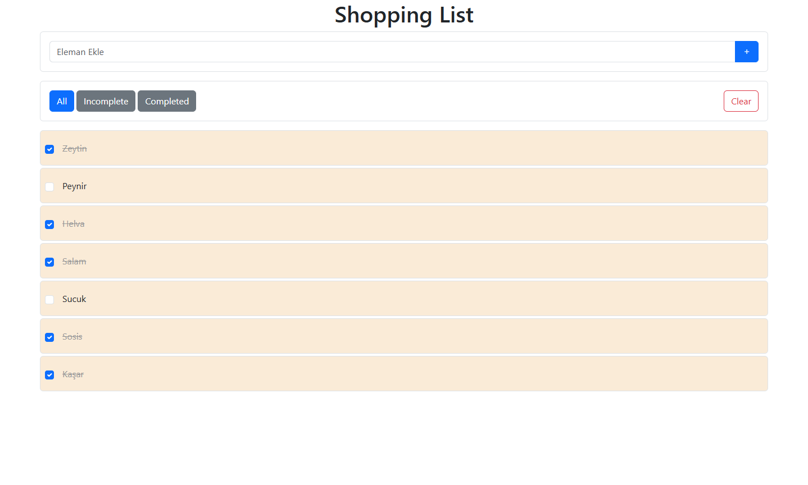

# Shopping List 🛒

Bu proje, React öğrenme sürecinde geliştirdiğim basit bir alışveriş listesi uygulamasıdır. Kullanıcıların listeye ürün ekleyip silebildiği, tamamlananları işaretleyebildiği ve çeşitli filtreleme seçeneklerini kullanabildiği temel bir yapılacaklar listesi mantığında çalışır.

## Özellikler

- 📝 Yeni ürün ekleme  
- ❌ Ürün silme  
- ✅ Tamamlandı / tamamlanmadı durumu  
- 🔍 Filtreleme: Tüm ürünler, tamamlananlar, tamamlanmayanlar  
- 🧹 Tümünü temizleme  
- 📱 Bootstrap ile responsive tasarım  
- ⚛️ React (Functional Components, useState, props)

## Teknolojiler

- React (useState)
- Bootstrap 5
- CSS

## Ekran Görüntüsü


## Kurulum ve Çalıştırma

1. Depoyu klonlayın:
   ```bash
   git clone https://github.com/MuhammedMustafaDemirhan/ShoppingList.git
   cd shopping-list

2. Bağımlılıkları yükleyin:
   ```bash
   npm install

3. Uygulamayı başlatın:
   ```bash
   npm run dev

Not:
Bu proje, React öğrenim sürecimde geliştirdiğim ilk projedir. Basit yapısıyla temel kavramları anlamak için faydalıdır. Geliştirmeye açıktır.

## İletişim

Her türlü soru, öneri veya geri bildirim için benimle iletişime geçebilirsiniz:

- 📧 **E-posta:** [muhammedmustafademirhan@gmail.com](mailto:muhammedmustafademirhan@gmail.com)  
- 💼 **LinkedIn:** [linkedin.com/in/muhammedmustafademirhan](https://www.linkedin.com/in/muhammedmustafademirhan/)  
- 📸 **Instagram:** [instagram.com/mami.dmrhn](https://www.instagram.com/mami.dmrhn/)
